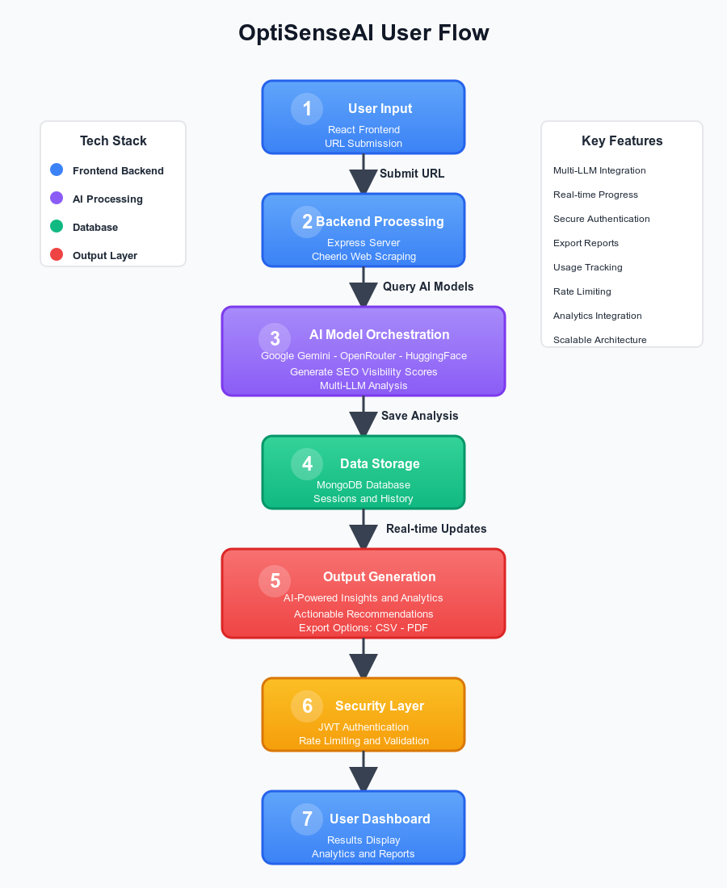

# OptiSenseAI - Full-Stack AI-Powered SEO Analyzer

A comprehensive full-stack application demonstrating advanced engineering skills in building scalable web applications with AI integration, real-time data processing, and secure user management.

## Example Flow

Imagine a user wants to analyze their website's SEO performance against AI search engines:

1. **User Input**: Submits a URL through the React frontend.
2. **Backend Processing**: Express server validates input, scrapes website data using Cheerio, and queries multiple LLMs (Google Gemini, OpenRouter) for visibility scores.
3. **Data Aggregation**: Results are stored in MongoDB with Mongoose schemas, including user sessions and scan history.
4. **Real-time Updates**: WebSocket integration (if implemented) or polling provides live progress updates.
5. **Output Generation**: Generates actionable recommendations using custom AI prompts, exports to CSV/PDF via pdfkit.
6. **Security Layer**: Rate limiting, JWT authentication, and input sanitization protect against abuse.

This flow showcases end-to-end development from UI/UX to backend APIs, database design, and AI model orchestration.

## Architecture Diagram



## Setup Instructions

To run this project locally and demonstrate the full-stack capabilities, you'll need the following API keys and environment setup:

### Required API Keys
1. **Google Gemini API Key** (Required): Core LLM functionality for AI-powered SEO analysis. Obtain from [Google AI Studio](https://makersuite.google.com/app/apikey).
2. **MongoDB Connection String** (Required): Database connection for storing user data, scans, and results. Use local MongoDB or MongoDB Atlas.
3. **JWT Secret** (Required): For secure authentication tokens.

### Optional API Keys (Premium Features)
- **HuggingFace Inference API Key**: Additional LLM model for enhanced analysis.
- **OpenRouter API Key**: Access to multiple AI models for comparative analysis.

### Environment Setup
1. Clone the repository and install dependencies:
   ```bash
   git clone <repo-url>
   cd OptiSenseAI
   cd backend && npm install
   cd ../frontend && npm install
   ```

2. Create `backend/.env` file with the following variables:
   ```
   GOOGLE_GEMINI_API_KEY=your_gemini_key_here
   MONGODB_URI=your_mongodb_connection_string
   JWT_SECRET=your_jwt_secret_here
   HUGGINGFACE_API_KEY=your_huggingface_key_here (optional)
   OPENROUTER_API_KEY=your_openrouter_key_here (optional)
   ```

3. Start MongoDB (using Docker or local installation):
   ```bash
   docker run -d -p 27017:27017 --name mongodb mongo:7
   ```

4. Run the application:
   ```bash
   # Terminal 1: Backend
   cd backend && npm run dev

   # Terminal 2: Frontend
   cd frontend && npm run dev
   ```

5. Open http://localhost:3000 to access the application.

## Technologies & Skills Demonstrated

### Backend Engineering
- **Node.js & Express**: Built RESTful APIs with middleware for authentication, rate limiting, and validation.
- **Database Design**: MongoDB with Mongoose for scalable data models (Users, Scans, Integrations).
- **AI Integration**: Orchestrated multiple LLM APIs (Google Gemini, HuggingFace, OpenRouter) with error handling and fallback mechanisms.
- **Security Implementation**: JWT-based auth, OTP verification, SSRF protection, and secure API key management.
- **Performance Optimization**: Asynchronous processing, caching strategies, and efficient data scraping.

### Frontend Engineering
- **React & Vite**: Modern SPA with component-based architecture, state management, and responsive design.
- **UI/UX Design**: Dark mode support, interactive components, and user-friendly forms.
- **API Consumption**: Axios for seamless backend communication with error handling.

### DevOps & Testing
- **Testing Suite**: Jest for unit and integration tests covering services, routes, and models.
- **Environment Management**: Docker for MongoDB, environment variable configuration.
- **Code Quality**: Modular architecture, error logging, and comprehensive documentation.

## Key Engineering Achievements

- **Multi-LLM Orchestration**: Dynamically queries 3+ AI models per analysis, aggregating results for comprehensive insights.
- **Scalable Architecture**: Modular services (SEO, LLM, Fingerprinting) allowing easy extension.
- **Real-time Features**: Implemented polling for live scan progress and results display.
- **Export Capabilities**: Generated reports in multiple formats using specialized libraries.
- **User Management**: Secure authentication with tiered access (Free/Premium) and usage tracking.
- **Data Processing**: Efficient web scraping and analysis pipelines handling various website structures.

## How It Helps

This tool empowers developers and businesses to:
- Evaluate website visibility in AI-driven search landscapes.
- Automate SEO audits with AI-powered recommendations.
- Compare performance against competitors using data-driven insights.
- Integrate with Google Analytics/Search Console for enhanced analytics.
- Scale analysis workflows with premium features like bulk processing.

Built to demonstrate proficiency in full-stack development, AI integration, and production-ready application architecture.
